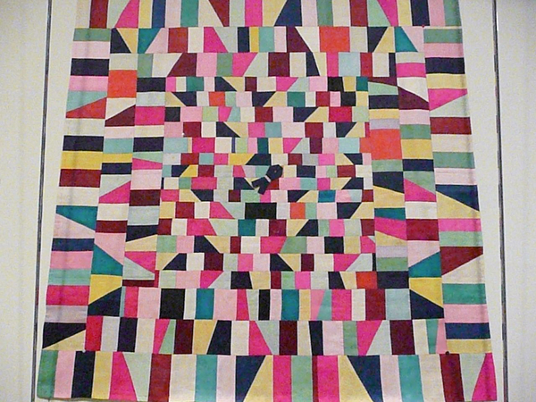
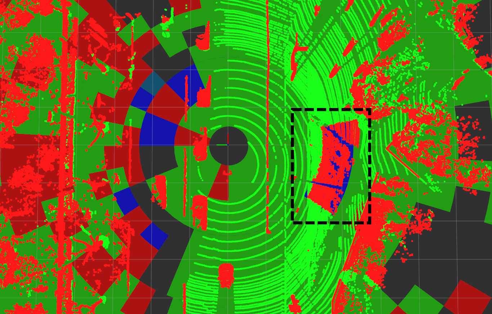
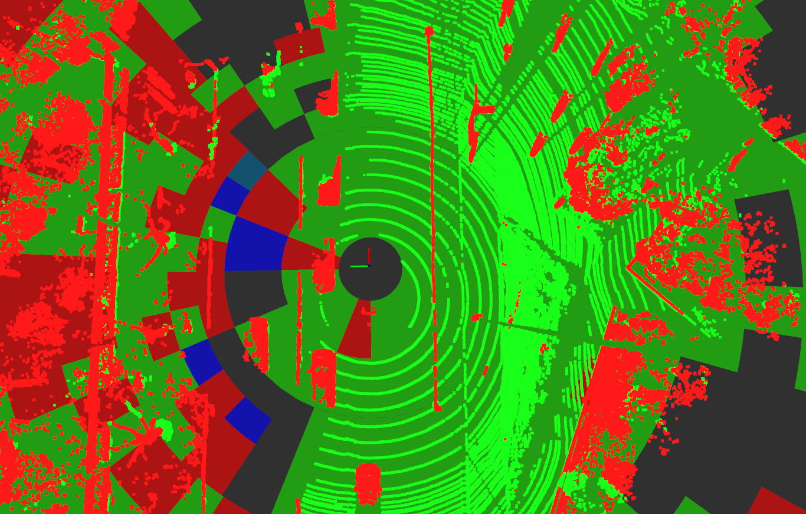

# Patchwork

Official page of *"Patchwork: Concentric Zone-based Region-wise Ground Segmentation with Ground Likelihood Estimation Using a 3D LiDAR Sensor"*, which is accepted by RA-L with IROS'21 option 

#### [[Video](https://youtu.be/rclqeDi4gow)] [[Preprint Paper](https://urserver.kaist.ac.kr/publicdata/patchwork/RA_L_21_patchwork_final_submission.pdf)] [[Project Wiki](https://github.com/LimHyungTae/patchwork/wiki)]

Patchwork                  |  Concept of our method (CZM & GLE)
:-------------------------:|:-------------------------:
 |  

It's an overall updated version of **R-GPF of ERASOR** [**[Code](https://github.com/LimHyungTae/ERASOR)**] [**[Paper](https://arxiv.org/abs/2103.04316)**]. 

# NEWS (21.12.27)
- "pub\_for\_legoloam" node for the pointcloud in kitti bagfile is added.
- bug in xy2theta function is fixed.
- comb.msg is created for binding source cloud and ground cloud
- How to run
```bash
roslaunch patchwork pub_for_legoloam.launch
rosbag play {YOUR_FILE_PATH}/KITTI_BAG/kitti_sequence_00.bag --clock /kitti/velo/pointcloud:=/velodyne_points
```

----

# Demo

## KITTI 00 


## Rough Terrain


----


### Characteristics

* Single hpp file (`include/patchwork/patchwork.hpp`)

* Robust ground consistency

As shown in the demo videos and below figure, our method shows the most promising robust performance compared with other state-of-the-art methods, especially, our method focuses on the little perturbation of precision/recall as shown in [this figure](img/seq_00_pr_zoom.pdf).

Please kindly note that the concept of *traversable area* and *ground* is quite different! Please refer to our paper.


## Contents
0. [Test Env.](#Test-Env.)
0. [Requirements](#requirements)
0. [How to Run Patchwork](#How-to-Run-Patchwork)
0. [Citation](#citation)

### Test Env.

The code is tested successfully at
* Linux 18.04 LTS
* ROS Melodic

## Requirements

### ROS Setting
- 1. Install [ROS](http://torch.ch/docs/getting-started.html) on a machine. 
- 2. Thereafter, [jsk-visualization](https://github.com/jsk-ros-pkg/jsk_visualization) is required to visualize Ground Likelihood Estimation status.

```bash
sudo apt-get install ros-melodic-jsk-recognition
sudo apt-get install ros-melodic-jsk-common-msgs
sudo apt-get install ros-melodic-jsk-rviz-plugins
```

- 3. Compile compile this package. We use [catkin tools](https://catkin-tools.readthedocs.io/en/latest/),
```bash
mkdir -p ~/catkin_ws/src
cd ~/catkin_ws/src
git clone https://github.com/LimHyungTae/patchwork.git
cd .. && catkin build patchwork 
```

## How to Run Patchwork

We provide three examples

* Offline KITTI dataset
* Online (ROS Callback) KITTI dataset
* Own dataset using pcd files

### Offline KITTI dataset

1. Download [SemanticKITTI](http://www.semantic-kitti.org/dataset.html#download) Odometry dataset (We also need labels since we also open the evaluation code! :)

2. Set the `data_path` in `launch/offline_kitti.launch` for your machine.

The `data_path` consists of `velodyne` folder and `labels` folder as follows:

```
data_path (e.g. 00, 01, ..., or 10)
_____velodyne
     |___000000.bin
     |___000001.bin
     |___000002.bin
     |...
_____labels
     |___000000.label
     |___000001.label
     |___000002.label
     |...
_____...
   
```

3. Run launch file 
```
roslaunch patchwork offline_kitti.launch
```

You can directly feel the speed of Patchwork! :wink:

### Online (ROS Callback) KITTI dataset

We also provide rosbag example. If you run our patchwork via rosbag, please refer to this example.

1. Download readymade rosbag 

```
wget https://urserver.kaist.ac.kr/publicdata/patchwork/kitti_00_xyzilid.bag
```

2. After building this package, run the roslaunch as follows:

```
roslaunch patchwork rosbag_kitti.launch
```

3. Then play the rosbag file in another command

```
rosbag play kitti_00_xyzilid.bag
```

### Own dataset using pcd files

Please refer to `/nodes/offilne_own_data.cpp`. 

(Note that in your own data format, there may not exist ground truth labels!)

Be sure to set right params. Otherwise, your results may be wrong as follows:

W/ wrong params            | After setting right params
:-------------------------:|:-------------------------:
 |  

For better understanding of the parameters of Patchwork, please read [our wiki, 4. IMPORTANT: Setting Parameters of Patchwork in Your Own Env.](https://github.com/LimHyungTae/patchwork/wiki/4.-IMPORTANT:-Setting-Parameters-of-Patchwork-in-Your-Own-Env.).


#### Offline (Using *.pcd or *.bin file)

1. Utilize `/nodes/offilne_own_data.cpp`

2. Please check the output by following command and corresponding files:

```
roslaunch patchwork offline_ouster128.launch
```

#### Online (via rosbag)

1. Utilize `rosbag_kitti.launch`.

2. To do so, remap the topic of subscriber, e.g. add remap line as follows:

```
<remap from="/node" to="$YOUR_LIDAR_TOPIC_NAME$"/>
```

3. In addition, minor modification of `ros_kitti.cpp` is necessary by refering to `offline_own_data.cpp`.

## Citation

If you use our code or method in your work, please consider citing the following:

	@article{lim2021patchwork,
    title={Patchwork: Concentric Zone-based Region-wise Ground Segmentation with Ground Likelihood Estimation Using a 3D LiDAR Sensor},
    author={Lim, Hyungtae and Minho, Oh and Myung, Hyun},
    journal={IEEE Robotics and Automation Letters},
    year={2021}
    }

---------

### Description

All explanations of parameters and other experimental results will be uploaded in [wiki](https://github.com/LimHyungTae/patchwork/wiki)

### Contact

If you have any questions, please let me know:

- Hyungtae Lim {[shapelim@kaist.ac.kr]()}


### TODO List

- [x] Add ROS support
- [x] Add preprint paper
- [x] Add demo videos
- [x] Add own dataset examples
- [x] Update wiki

-----

